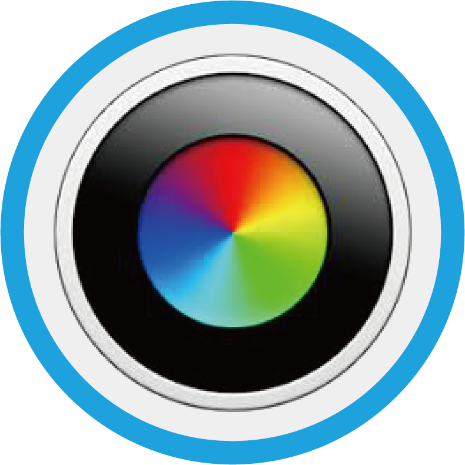
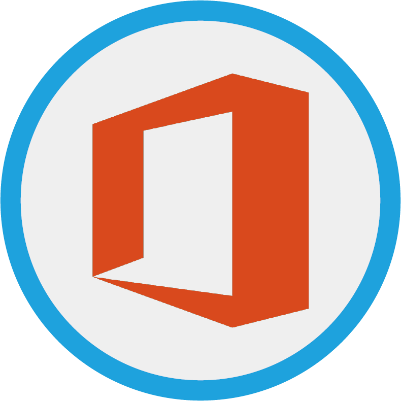
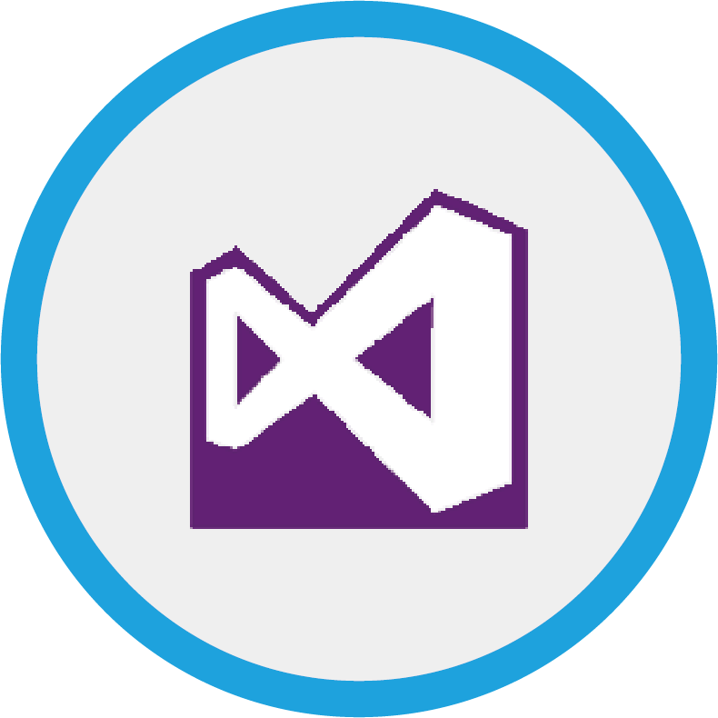
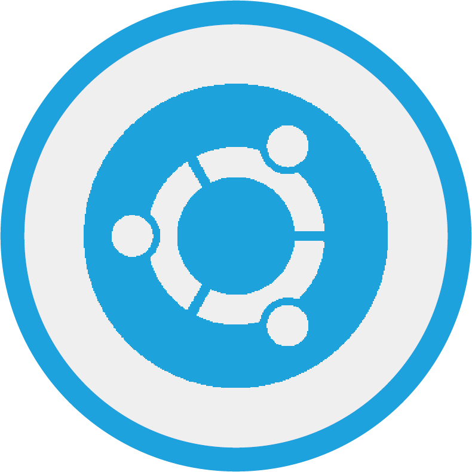
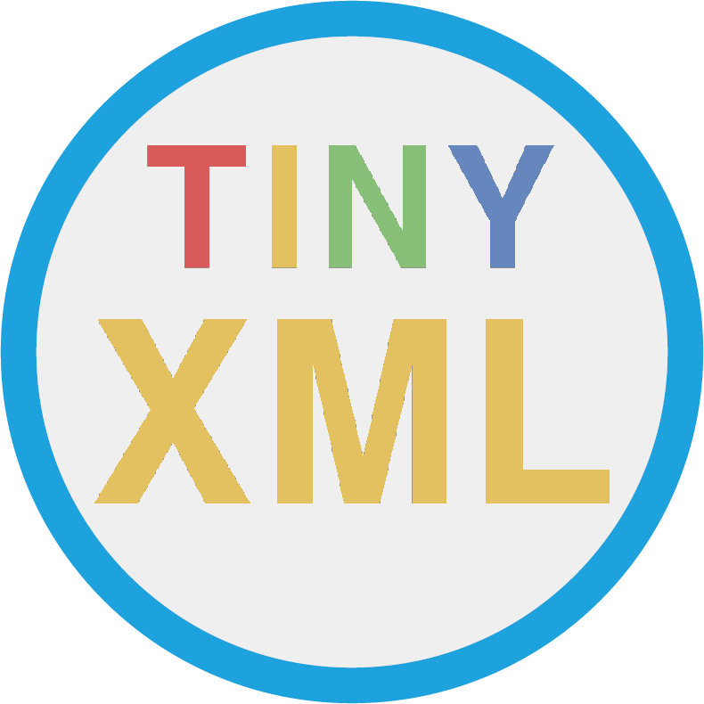

  WSpring
---------------------------------------------------------------------------------------------------------------------

Windows(x64) Programming Library & Tool Setup Project
-----------------------------------------------------

### Global/Local

Global install is installing library on compiler directory. It can run directly your source code without any settings. Local library is installing library on your project directory. You have to use local library if you consider move or release your project.
In this project will install library as global.

### x86/x64

Drop x86(32bit application). x86 is past technology on desktop computer. Actually many libraries don't support x86 system.

### Shared/Static

This option is actually not important. But consider if you want use independent executable file. But static library depends on compiler. MSVC14's library will not work on MSVC15. So we use shared library.


Installer
----------------------------

### Atom


**[Atom](https://atom.io/)** is a text editor that's modern, approachable, yet hackable to the core—a tool you can customize to do anything but also use productively without ever touching a config file.

You can use atom for writing markdown documents instead of Haroopad. It supports synchronization too.

### Bandizip


**[Bandizip](https://www.bandisoft.co.kr/bandizip/)** is a lightweight, fast and free All-In-One Zip Archiver. Bandizip has a very fast Zip algorithm for compression & extraction with Fast Drag and Drop, High Speed Archiving, and Multi-core compression. It handles the most popular compression formats, including Zip, 7z, Rar, and so on.

### Bomi


**[Bomi](https://bomi-player.github.io/)** is a multimedia player formerly known as CMPlayer, which is aimed for easy usage but also provides various powerful features and convenience functions. Just install and enjoy it! There will be already what you expect. If you don't like, you can configure almost everything.


### Chrome


**[Google Chrome](https://www.google.co.kr/chrome/index.html)** is a freeware web browser developed by Google. It was first released in September 2008, for Microsoft Windows, and was later ported to Linux, macOS, iOS and Android. Google Chrome is also the main component of Chrome OS, where it serves as a platform for running web apps.

### Clion


**[CLion](https://www.jetbrains.com/clion/)** is a smart C and C++ editor. It using CMake as a project model, CLion handles your changes in CMake files automatically, using all the information from there during code editing and refactorings.

### Clover


**[Clover](http://en.ejie.me/)** is an extension of the Windows Explorer, to add multi-tab functionality similar to Google Chrome browser. After install Clover, you will be able to open multiple folders within the same window, and you can also add folder bookmarks.

### CMake


**[CMake](https://cmake.org/)** is an open-source, cross-platform tools to build. Maybe you are using cmake as CLI(Command-Line-Interface) in Linux. Windows is same with Linux. You have to install this script before every build scripts.

### CUDA


**You have to install nvidia-driver before install cuda.**

**[CUDA](https://developer.nvidia.com/cuda-downloads)** is a parallel computing platform and programming model developed by NVIDIA for general computing on graphical processing units (GPUs). With CUDA, developers are able to dramatically speed up computing applications by harnessing the power of GPUs.

And this script converts cuda include files to UNICODE. Because, Visual Studio(Korean ver) shows sooooo many encoding warnings if it used original encoding files.

### cudnn


The NVIDIA CUDA® Deep Neural Network library (**[cuDNN](https://developer.nvidia.com/cudnn)**) is a GPU-accelerated library of primitives for deep neural networks. cuDNN provides highly tuned implementations for standard routines such as forward and backward convolution, pooling, normalization, and activation layers. cuDNN is part of the NVIDIA Deep Learning SDK.

### FileZilla


**[FileZilla](https://filezilla-project.org/)** Client is a fast and reliable cross-platform FTP, FTPS and SFTP client with lots of useful features and an intuitive graphical user interface.

### Firefox56


Mozilla **[Firefox](https://www.mozilla.org/ko/firefox/new/)** (or simply Firefox) is a free and open-source web browser developed by Mozilla Foundation and its subsidiary, Mozilla Corporation. Firefox-56 is the latest version before Quantum. Quantum not support multirow-tab and multirow-bookmark. so i still use firefox56.

### Foxit PDF Reader


**[Foxit Reader](https://www.foxitsoftware.com/pdf-reader/)** is the PDF Reader which enables you to become part of the connected world. Provide authors with comments on documents, be notified when new document versions become available, discuss interesting topics right in the document, or securely open protected documents.

### Git


**[Git](https://git-scm.com/)** is a free and open source distributed version control system designed to handle everything from small to very large projects with speed and efficiency.

Git is easy to learn and has a tiny footprint with lightning fast performance. It outclasses SCM tools like Subversion, CVS, Perforce, and ClearCase with features like cheap local branching, convenient staging areas, and multiple workflows.

### Haroopad


**[Haroopad](http://pad.haroopress.com/user.html)** is a markdown enabled document processor for creating web-friendly documents.

### HDDB


Hddb is a capable search tool which will quickly find files on any NTFS drive.

### HoneyCam


**[Honeycam](https://kr.bandisoft.com/honeycam/)** is a High-quality animated GIF maker and editor. Make your animation files of gameplay, video highlights, and PC tutorials.

### HoneyView


**[Honeyview](https://www.bandisoft.com/honeyview/)** is a very fast image viewer supporting various formats. It also supports viewing the images in compressed ZIP, RAR, or 7z files without extraction. If an image has GPS information, the location can be viewed on Google Maps, and users can store preferred photos.


### JAVA


**[OpenJDK](http://openjdk.java.net/)** is the place to collaborate on an open-source implementation of the Java Platform, Standard Edition, and related projects.

### KakaoTalk


**[KakaoTalk](https://www.kakaocorp.com/service/KakaoTalk)** is a free mobile instant messaging application for smartphones with free text and free call features.

### Mercurial


**[Mercurial](https://www.mercurial-scm.org/)** is a free, distributed source control management tool. It efficiently handles projects of any size and offers an easy and intuitive interface.

### MinGW64


**[MinGW-w64](https://mingw-w64.org/doku.php)** is an advancement of the original mingw.org project, Created to support the GCC compiler on Windows system. You can use this compiler on Windows **[CLion](https://www.jetbrains.com/clion/)**.

### Notepad++


**[Notepad++](https://notepad-plus-plus.org/)** is a free (as in "free speech" and also as in "free beer") source code editor and Notepad replacement that supports several languages. Running in the MS Windows environment, its use is governed by GPL License.

### NVIDIA driver


Install drivers for NVIDIA products including GeForce graphics cards.

* NVIDIA TITAN Series:
	* NVIDIA TITAN V, NVIDIA TITAN Xp, NVIDIA TITAN X (Pascal), GeForce GTX TITAN X, GeForce GTX TITAN, GeForce GTX TITAN Black, GeForce GTX TITAN Z
* GeForce 10 Series:
	* GeForce GTX 1080 Ti, GeForce GTX 1080, GeForce GTX 1070 Ti, GeForce GTX 1070, GeForce GTX 1060, GeForce GTX 1050 Ti, GeForce GTX 1050, GeForce GT 1030
* GeForce 900 Series:
	* GeForce GTX 980 Ti, GeForce GTX 980, GeForce GTX 970, GeForce GTX 960, GeForce GTX 950
* GeForce 700 Series:
	* GeForce GTX 780 Ti, GeForce GTX 780, GeForce GTX 770, GeForce GTX 760, GeForce GTX 760 Ti (OEM), GeForce GTX 750 Ti, GeForce GTX 750, GeForce GTX 745, GeForce GT 740, GeForce GT 730, GeForce GT 720, GeForce GT 710, GeForce GT 705
* GeForce 600 Series:
	* GeForce GTX 690, GeForce GTX 680, GeForce GTX 670, GeForce GTX 660 Ti, GeForce GTX 660, GeForce GTX 650 Ti BOOST, GeForce GTX 650 Ti, GeForce GTX 650, GeForce GTX 645, GeForce GT 645, GeForce GT 640, GeForce GT 635, GeForce GT 630, GeForce GT 620, GeForce GT 610, GeForce 605
* GeForce 500 Series:
	* GeForce GTX 590, GeForce GTX 580, GeForce GTX 570, GeForce GTX 560 Ti, GeForce GTX 560 SE, GeForce GTX 560, GeForce GTX 555, GeForce GTX 550 Ti, GeForce GT 545, GeForce GT 530, GeForce GT 520, GeForce 510
* GeForce 400 Series:
	* GeForce GTX 480, GeForce GTX 470, GeForce GTX 465, GeForce GTX 460 SE v2, GeForce GTX 460 SE, GeForce GTX 460, GeForce GTS 450, GeForce GT 440, GeForce GT 430, GeForce GT 420
* GeForce MX100 Series (Notebook):
	* GeForce MX150, GeForce MX130, GeForce MX110
* GeForce 10 Series (Notebooks):
	* GeForce GTX 1080, GeForce GTX 1070, GeForce GTX 1060, GeForce GTX 1050 Ti, GeForce GTX 1050
* GeForce 900M Series (Notebooks):
	* GeForce GTX 980, GeForce GTX 980M, GeForce GTX 970M, GeForce GTX 965M, GeForce GTX 960M, GeForce GTX 950M, GeForce 945M, GeForce 940MX, GeForce 930MX, GeForce 920MX, GeForce 940M, GeForce 930M, GeForce 920M, GeForce 910M
* GeForce 800M Series (Notebooks):
	* GeForce GTX 880M, GeForce GTX 870M, GeForce GTX 860M, GeForce GTX 850M, GeForce 845M, GeForce 840M, GeForce 830M, GeForce 825M, GeForce 820M, GeForce 810M, GeForce 800M
* GeForce 700M Series (Notebooks):
	* GeForce GTX 780M, GeForce GTX 770M, GeForce GTX 765M, GeForce GTX 760M, GeForce GT 755M, GeForce GT 750M, GeForce GT 745M, GeForce GT 740M, GeForce GT 735M, GeForce GT 730M, GeForce GT 720M, GeForce GT 710M, GeForce 710M, GeForce 705M
* GeForce 600M Series (Notebooks):
	* GeForce GTX 680MX, GeForce GTX 680M, GeForce GTX 675MX, GeForce GTX 675M, GeForce GTX 670MX, GeForce GTX 670M, GeForce GTX 660M, GeForce GT 650M, GeForce GT 645M, GeForce GT 640M, GeForce GT 640M LE, GeForce GT 635M, GeForce GT 630M, GeForce GT 625M, GeForce GT 620M, GeForce 610M
* GeForce 500M Series (Notebooks):
	* GeForce GTX 580M, GeForce GTX 570M, GeForce GTX 560M, GeForce GT 555M, GeForce GT 550M, GeForce GT 540M, GeForce GT 525M, GeForce GT 520M, GeForce GT 520MX
* GeForce 400M Series (Notebooks):
	* GeForce GTX 485M, GeForce GTX 480M, GeForce GTX 470M, GeForce GTX 460M, GeForce GT 445M, GeForce GT 435M, GeForce GT 425M, GeForce GT 420M, GeForce GT 415M, GeForce 410M

### Office365


Office 365 is the brand name Microsoft uses for a group of subscriptions that provides productivity software and a related services. And you need serial key. This script is not illegal. I don't provide any serial key.

### Opera


**[Opera](https://www.opera.com/ko)** is a web browser for Windows, macOS, and Linux operating systems developed by Opera Software AS. It uses the Blink layout engine. An earlier version using the Presto layout engine is still available and runs on FreeBSD systems

### Path Copy Copy


Copy file paths as Unix format from Windows explorer's contextual menu which means you can use file path on C/C++ code directly!!.

### Potplayer


**[PotPlayer](https://tv.kakao.com/guide/potplayer)** is a multimedia software player developed for the Microsoft Windows operating system by South Korean Internet company Kakao (formerly Daum Communications).

### Perl5


**[Strawberry Perl](http://strawberryperl.com/)** is a perl environment for MS Windows containing all you need to run and develop perl applications. It is designed to be as close as possible to perl environment on UNIX systems.

### Python2.7


**[Python](https://www.python.org/)** is light-weight script language. I don't like python. But many interfaces of deep-learning libraries are python2 or python3. So we need both of them as python2.exe and python3.exe. This script will install Python2.7.14 at `C:\Python27\`. You can run python2.X as `python2.exe` and `pip2.exe`.

### Python3.6.4


This script will install Python3.6 at `C:\Python36\`. You can run python3.X as `python3.exe` and `pip3.exe`.

### ShareX


**[ShareX](https://getsharex.com/)** is an open source program that lets you take screenshots or screencasts of any selected area with a single key, save them in your clipboard, hard disk or instantly upload them to over 80 different file hosting services.

### Speccy


**[Speccy](https://www.ccleaner.com/speccy)** is the place to start if you need to know what’s inside your PC. See a quick summary, or dive deeper into every aspect of your PCs hardware.

### Teamviewer


**[TeamViewer](www.teamviewer.com)** is a proprietary computer software package for remote control, desktop sharing, online meetings, web conferencing and file transfer between computers.

### Visual Studio 2015


Microsoft **[Visual Studio](https://www.visualstudio.com/)** is an integrated development environment (IDE) from Microsoft. It is used to develop computer programs, as well as web sites, web apps, web services and mobile apps. Visual Studio uses Microsoft software development platforms such as Windows API, Windows Forms, Windows Presentation Foundation, Windows Store and Microsoft Silverlight. It can produce both native code and managed code.

**Included package**
* Visual C++

**Not included package**
* Python
* Visual F#

### WSL


Windows Subsystem for Linux (WSL) is a compatibility layer for running Linux binary executables (in ELF format) natively on Windows 10. Do not install WSL from Windows store if you are korean. This script will install WSL(current locale) and Xming(for GUI) automatically.

Libraries
---------

### OpenCV


**[OpenCV](https://opencv.org/)** is open source computer vision library. Please install opencv correctly way. Many people install opencv strange way *(e.g. C:/Opencv)* . Also OpenCV dropped C interface after version 3.0. So you need to install both 2.4.X and 3.X if you are C/C++ programmer.

Usually, we use gcc(MinGW64), g++(MinGW64), Visual Studio(/TC), Visual Studio(/TP) in Windows OS for C/C++.  
It will install opencv2.x for C compiler and install opencv3.x(contrib,world) for C++ compiler.

This Installer will change something. That will select automatically correct version for your compiler.

gcc and /TC will select OpenCV2.X.

g++ and /TP will select OpenCV3.x(contrib).

So, You don't have to any settings for Visual Studio. library link command(#pragma comment) is already wrote in opencv header file. and all dll is copied to System folder.

But you need link libraries in MinGW64.
Here is sample build command using environment variable.
```batch
gcc <...> %opencv2%
```
```batch
g++ <...> %opencv3%
```

###  OpenBLAS


**[OpenBLAS](http://www.openblas.net/)** is an optimized BLAS library based on GotoBLAS2 1.13 BSD version. Usually we use BLAS for Matrix Multiplication in C. C++ has [Eigen](eigen.tuxfamily.org/) and Python has numpy.

Likewise library link command is in cblas.h. You just need to include. and if you are using gcc then link below command.

```batch
gcc <...> -lopenblas
```

There is a example code in [tests/OpenBLAS_Tests](tests/OpenBLAS_Tests).


###  TinyXML2


**[TinyXML-2](http://www.grinninglizard.com/tinyxml2/)** is a simple, small, efficient, C++ XML parser that can be easily integrating into other programs.

###  glog


**[glog](https://github.com/google/glog)** is google logging library.

###  hdf5


Hierarchical Data Format is a set of file formats designed to store and organize large amounts of data.

###  zlib


zlib is a software library used for data compression. zlib was written by Jean-loup Gailly and Mark Adler and is an abstraction of the DEFLATE compression algorithm used in their gzip file compression program.

## Enabler

###  Enable Remote Desktop

RDP is the best tool of Remote PC controller.

Uninstaller
-----------
###  Uninstall Onedrive

**[Onedrive](https://onedrive.live.com/)** is too slow and not robust for synchronization. I recommend **[Dropbox](https://www.dropbox.com)**.
